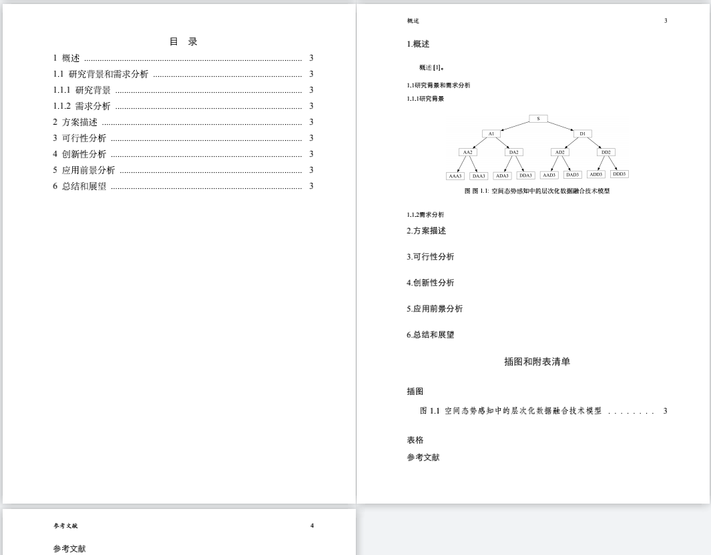

## 第三届“空天杯”全国创新创意大赛初赛论文Latex模版
### 1 更新记录
2021-05-21 初步形成模版文件，现只支持作者属于同一单位时的多作者填写，同时格式上官方要求有冲突的地方，所以会在后期官方更正之后更新或者大家自行改吧。
### 2 食用方法
使用xelatex-bibtex-xelatex-xelatex四步进行编译。 

### 3 在线求star呀🌟,谢谢老板～
如果有bug请发邮箱或者使用文件中的qq联系在下～